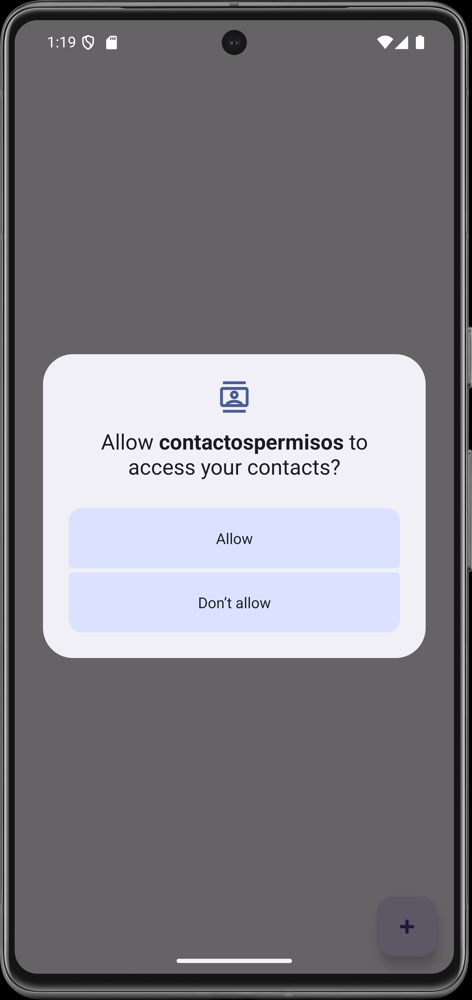
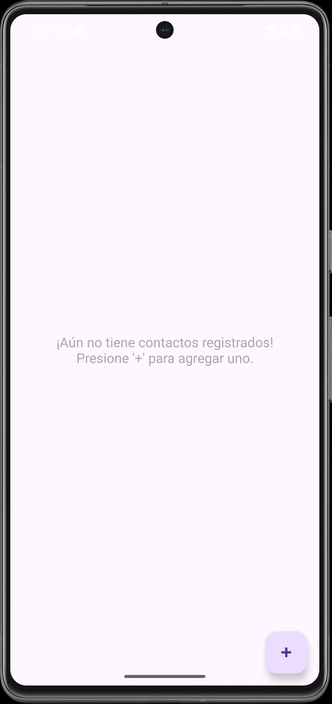
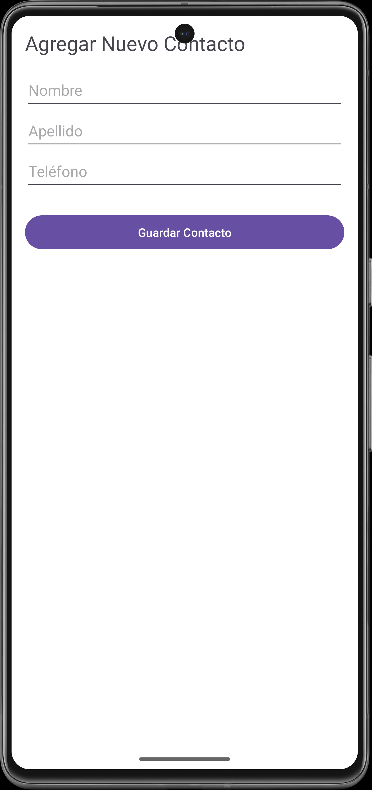
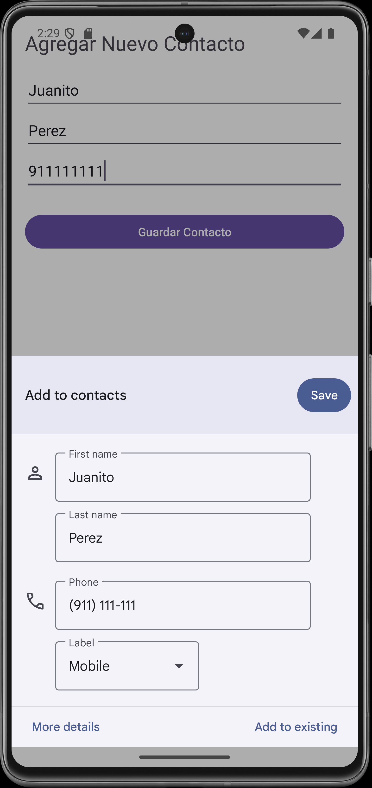
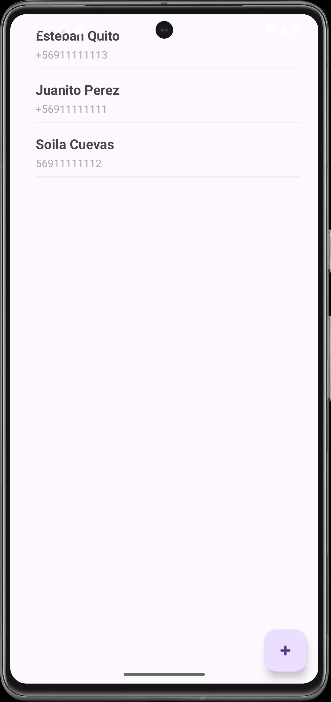

# 📖 AE2-ABP1 Gestionar Permisos Agenda de Contactos

Este mini proyecto, permite demostrar el uso de permisos sensibles mediante una aplicación de agenda de contactos en Android Studio, desarrollado en Kotlin, utilizando Fragments y RecyclerView, solicitando permiso para leer los contactos, y accediendo directamente al objeto "Contacts" para agregar nuevos usuarios sin afectar las directivas de protección de datos sensibles. La interfaz muestra, inicialmente, la lista de contactos (siempre que existan datos previos, en su defecto muestra un mensaje de lista vacía), usa un FAB ("+" flotante) para agregar un nuevo contacto mostrando un formulario de entrada, al completar la operación, un listener, actualiza la pantalla y muestra la nueva lista actualizada.

## ✨ Características

- 📋 **Lista de Contactos** : Se muestra en un `RecyclerView` dentro de la `MainActivity`.
- ➕ **Añadir Contactos** : Botón flotante para agregar un nuevo contacto.
- 📄 **Formulario Nuevo Contacto** : Muestra un formulario con los campos nombre, apellido y teléfono de tipo texto.

## 📌 Tecnologías utilizadas

- **Kotlin** : Lenguaje de desarrollo.
- **RecyclerView**: Para mostrar la lista de contactos.
- **Fragments** : Para el formulario de nuevo contacto.

## 📸 Capturas de pantalla

